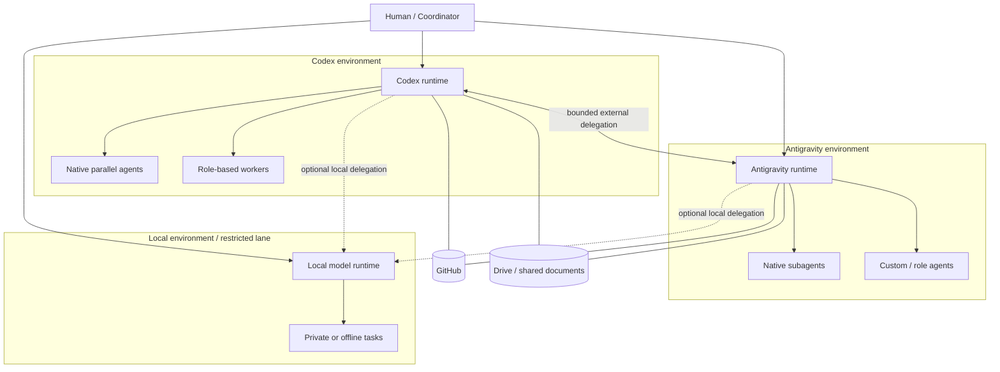

# Codex × Antigravity Collaboration

> A practical reference architecture for coordinating native agent runtimes without introducing another orchestration framework.

This repository documents a **working collaboration pattern** built around Codex and Google Antigravity, with a path toward local models, privacy-aware routing, and multi-host execution.

It is intentionally **not** a new agent framework, scheduler, message bus, or enterprise security product.

> **Repository type:** documentation-first reference architecture and case study. It captures architecture patterns, operational contracts, status, and design decisions from a working private reference setup. It is **not an installable package** and does not currently ship a standalone runtime.

The central idea is simple:

> **Use native agent capabilities first. Add coordination infrastructure only when the workload proves that it is needed.**

## Why this exists

Modern agent platforms are becoming capable in different ways:

- Codex provides strong coding workflows, parallel agents, worktrees, Skills, and engineering-oriented execution.
- Antigravity provides its own parallel subagents, custom agents, browser/Google integrations, Projects, Skills, MCPs, and hooks.
- Local models can cover private, offline, or network-restricted tasks.
- GitHub and Drive already provide durable shared workspaces for many asynchronous workflows.

The question is therefore less “which framework should coordinate everything?” and more:

> **How can existing runtimes cooperate while preserving their native strengths, limiting duplicated context, and keeping unnecessary infrastructure out of the critical path?**

## Design principles

1. **Native capabilities first**  
   Do not rebuild parallel-agent or subagent features that the platforms already provide.

2. **Capability-aware routing**  
   Route work to the runtime best suited to the task instead of sending every task to every model.

3. **Bounded delegation**  
   A runtime may fan out internally, but cross-runtime delegation is hop-limited to prevent recursive agent chains.

4. **Shared skills, thin adapters**  
   Reuse portable skills where possible. Keep platform-specific behavior in small adapters rather than duplicating the core method.

5. **Progressive coordination**  
   Start with GitHub/Drive as a shared workspace. Add MCP/A2A-style explicit coordination only when needed. Add a broker only when retries, leases, heartbeats, or real-time state become actual requirements.

6. **Distributed write ownership**  
   Many agents may read, analyze, and review. Conflicting write-sets should have one active owner at a time. **Today this is a coordination policy, not a distributed-lock service:** isolation relies on Git branches/worktrees and optimistic concurrency, with PR/review/merge as the conflict-resolution gate.

7. **Privacy-aware routing**  
   Keep restricted data local. Where cloud use is appropriate, minimize and pseudonymize context before it crosses the trust boundary.

8. **Roadmap is not implementation**  
   Every capability in this repository is labeled **Implemented**, **Partial**, **Planned**, or **Exploratory**.

## Reference topology



A key distinction is that **a host or platform is not a single agent**. Each runtime can already contain its own coordinator, role-based workers, and parallel agents. Cross-platform coordination therefore happens **between agent runtimes**, not merely between individual prompts.

See [Architecture](docs/ARCHITECTURE.md).

## Current status

| Capability | Status | Notes |
|---|---|---|
| Codex ↔ Antigravity bridge / smoke path | **Implemented** | Core bridge path has passed a read-only smoke test. |
| Task / Result collaboration packet | **Implemented** | Used as the common request/result contract. |
| Bounded external delegation | **Implemented** | One-hop guard is part of the current collaboration protocol. |
| Read-only bounded debate | **Implemented** | Maximum two rounds in the current reference workflow. |
| Platform-native parallel agents | **Implemented / Native** | Delegated to Codex and Antigravity rather than reimplemented here. |
| Shared skills model | **Partial** | Direction is implemented, but canonical-source convergence is not yet fully verified. |
| Local-model bridge | **Experimental** | Existing local-model communication has been exercised separately; it is not yet the trust-routing layer described below. |
| Privacy-aware routing | **Planned** | Architecture defined; production-grade privacy gateway is not claimed. |
| Multi-host coordination | **Exploratory** | Shared-workspace approach is the starting point; protocol/broker evolution remains future work. |
| Broker, leases, heartbeat, retry | **Exploratory** | Explicitly deferred until scale requires them. |

The status table is intentionally conservative. See [Status and Roadmap](docs/STATUS_AND_ROADMAP.md).

## Collaboration model

The architecture distinguishes four forms of collaboration:

1. **Intra-runtime parallelism** — platform-native parallel agents or subagents.
2. **Vertical delegation** — coordinator → specialized worker roles inside one runtime.
3. **Inter-runtime delegation** — Codex ↔ Antigravity, or another external runtime.
4. **Inter-host delegation** — the same pattern extended across machines.

Internal fan-out can be rich. External delegation is deliberately narrower.

```text
Runtime A
├─ internal agent
├─ internal agent
└─ external delegation ──> Runtime B
                           ├─ internal agent
                           └─ internal agent

External delegation does not recursively bounce across runtimes without an explicit new decision.
```

## Privacy-aware extension

The proposed trust model uses four data classes:

| Class | Default route |
|---|---|
| **Public** | Cloud direct |
| **Internal** | Local redaction/minimization → cloud if policy allows |
| **Sensitive** | Reversible pseudonymization → cloud if policy allows → local restore |
| **Restricted** | Local only |

This is **risk reduction, not risk elimination**. Pseudonymization is not encryption-in-use, and remaining context may still support semantic re-identification.

Mature projects such as [Presidio](https://github.com/data-privacy-stack/presidio) can supply sensitive-data detection primitives. A local model can optionally supplement deterministic rules by identifying organization-specific concepts that conventional PII detectors may not recognize. The local model should **not** be the sole policy authority.

See [Privacy and Trust](docs/PRIVACY_AND_TRUST.md).

## Coordination should evolve only when necessary

```text
Stage 1 — Shared workspace
GitHub / Drive
        ↓
Stage 2 — Explicit coordination
MCP bridge / A2A-style agent communication
        ↓
Stage 3 — Brokered coordination
queue / state / lease / heartbeat / retry / timeout
```

The default is **Stage 1** for low-frequency asynchronous work. Stage 2 and Stage 3 are upgrades, not prerequisites.

## What this project deliberately does not build

- another multi-agent runtime;
- a universal scheduler;
- a custom distributed database;
- a vector database just for coordination;
- a new gateway when an existing bridge is sufficient;
- unrestricted recursive agent delegation;
- a claim of “fully autonomous” operation;
- a claim that pseudonymization makes cloud processing safe or compliant by itself.

## Documentation

- [Architecture](docs/ARCHITECTURE.md)
- [Design Principles](docs/DESIGN_PRINCIPLES.md)
- [Privacy and Trust](docs/PRIVACY_AND_TRUST.md)
- [Status and Roadmap](docs/STATUS_AND_ROADMAP.md)
- [References](docs/REFERENCES.md)
- [Architecture overview — Traditional Chinese](docs/index.html)

Traditional Chinese overview: [README.zh-TW.md](README.zh-TW.md)

## Project maturity

This repository is best read as a **reference architecture plus a working two-runtime case study**.

The currently implemented core is Codex + Antigravity collaboration. Local privacy routing and distributed multi-host coordination are documented as future directions because the architecture should remain understandable before it becomes distributed.

## License

MIT License. See [LICENSE](LICENSE).
