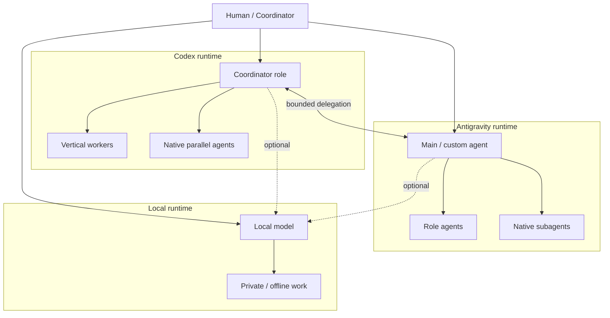

# Architecture

## Scope

This document describes the smallest architecture that explains the project.

The current reference implementation is centered on **Codex + Antigravity**. Local-model privacy routing and multi-host coordination are extensions, not prerequisites.

## Thesis

The architecture treats each platform as an **agent runtime**, not as a single agent.

A runtime may already provide:

- a primary/coordinator agent;
- role-specific agents;
- native parallel agents or subagents;
- workspace isolation or worktrees;
- skills;
- tool permissions;
- browser, MCP, or external integrations.

Cross-platform design should therefore coordinate **runtimes** while leaving internal scheduling to each runtime whenever possible.

## Topology



## Four collaboration dimensions

### 1. Intra-runtime parallelism

Use the platform's native parallel agents/subagents.

Examples:
- Codex parallel agent threads and worktrees.
- Antigravity background subagents.

This project does not rebuild those schedulers.

### 2. Vertical delegation

A coordinator assigns a bounded task to a specialized worker inside the same runtime.

The private reference environment uses named roles, but the reusable abstraction is:

```text
Coordinator
├─ Fast / low-cost worker
└─ Deep / implementation worker
```

Role names are local configuration, not architectural requirements.

### 3. Inter-runtime delegation

A runtime asks another runtime to perform a task or provide a second opinion.

```text
Codex  ─────> Antigravity
Codex  <───── Antigravity
```

External delegation uses a small request/result contract and a hop limit.

### 4. Inter-host delegation

The same inter-runtime pattern can later cross machine boundaries:

```text
Host A / Codex
        ↓
Host B / Antigravity
        ↓
Host C / local model
```

Multi-host transport is not part of the current core implementation.

## Bounded delegation

Internal fan-out and external delegation are intentionally treated differently.

```text
Runtime A
├─ internal agent
├─ internal agent
└─ Runtime B
   ├─ internal agent
   └─ internal agent
```

The receiving runtime may use its own native agents, but it should not automatically bounce the task back to another external runtime without a new explicit routing decision.

This avoids:

- recursive delegation loops;
- hidden token/context multiplication;
- unclear write ownership;
- difficult failure attribution.

## Lightweight collaboration contract

The current two-runtime workflow uses a structured request/result shape.

A task should minimally communicate:

- objective;
- relevant context or source of truth;
- constraints;
- allowed/prohibited actions;
- expected output;
- validation criteria;
- stop condition;
- return target.

A result should minimally communicate:

- status;
- summary;
- evidence;
- changes;
- validation result;
- risks;
- unresolved items;
- recommended next action.

The contract is deliberately small. It is a coordination aid, not a new protocol standard.

## Capability-aware routing

Routing should reflect capabilities and trust boundaries rather than model loyalty.

| Work type | Preferred direction |
|---|---|
| Repository implementation / engineering | Codex |
| Google ecosystem / browser-heavy work | Antigravity |
| Private or offline work | Local runtime |
| Independent review | A different runtime/model when useful |
| Routine low-risk work | Cheapest sufficient worker |
| High-risk changes | Stronger verification and explicit write owner |

These are routing heuristics, not hard-coded universal rules.

## Shared skills

Portable methods should have one canonical source where practical.

```text
Shared skill
   ├─ Codex adapter, if required
   ├─ Antigravity adapter, if required
   └─ Local adapter, if required
```

The architecture prefers standard skill packaging and thin platform adapters over copying whole skill trees.

Current status is **Partial** because canonical-source convergence has not yet been fully re-verified in the private reference environment.

## Shared workspace versus message transport

For low-frequency asynchronous work, GitHub and Drive can serve as a **shared workspace / blackboard**:

```text
GitHub Issue / task file
        ↓
Agent work
        ↓
PR / result / document
        ↓
Review
```

This is useful precisely because it requires no new server.

It should not be confused with a real-time message bus.

When explicit agent-to-agent state becomes necessary, the architecture can progress to a dedicated protocol or bridge.

## Coordination evolution

### Stage 1 — Shared Workspace

Use existing durable systems:

- GitHub: code, issues, branches, pull requests, history.
- Drive: documents, sources, task/result artifacts.

Best for:
- individual or small-team use;
- few runtimes;
- asynchronous work;
- low coordination frequency.

### Stage 2 — Explicit Coordination

Use an existing MCP bridge or an agent interoperability protocol such as A2A when runtime-to-runtime requests need explicit transport semantics.

Add only what is required:

- request/result identity;
- routing;
- scoped permissions;
- hop limit;
- timeout.

### Stage 3 — Brokered Coordination

Only when workload scale requires it, introduce a thin broker for:

- queue/state;
- task lease;
- heartbeat;
- retry;
- timeout;
- failure recovery.

The broker does not replace GitHub or Drive. It only owns coordination state.

## Distributed write ownership

“Single writer” should not mean “only one agent may work.”

The safer rule is:

> **One active write owner per conflicting write-set.**

### Current enforcement model

This is **not** a custom distributed mutex or global lock service.

For Git-managed artifacts, the current pattern uses:

1. task-level ownership assignment;
2. branch/worktree isolation for concurrent writers;
3. Git optimistic concurrency for detecting divergent changes;
4. PR/review/merge as the integration gate.

If two agents still modify overlapping content, the conflict is surfaced at integration time rather than hidden behind a project-owned distributed state machine.

Parallel work remains possible when isolated:

```text
Task A -> branch/worktree A -> Writer A
Task B -> branch/worktree B -> Writer B
Task C -> branch/worktree C -> Writer C

A/B/C -> Review / Merge Gate -> Main
```

For non-Git artifacts, use the same principle:

```text
Agent A -> draft A
Agent B -> analysis B
Agent C -> review
              ↓
         merge authority
              ↓
          final artifact
```

If future multi-host coordination needs concurrent write ownership, a lease can be added at Stage 3. It is not necessary in the current architecture.

## Failure containment

The architecture prefers failure to remain local to one task or runtime.

Controls include:

- bounded external hops;
- explicit write ownership;
- workspace/worktree isolation;
- read-only debate by default;
- validation before merge/finalization;
- preserving platform-native approval boundaries.

## Deliberate non-goals

This architecture does not aim to become:

- a universal agent runtime;
- a distributed operating system;
- a replacement for Codex or Antigravity internal schedulers;
- a generic workflow engine;
- a message broker;
- a security boundary by prompt alone;
- an enterprise compliance product.

Those non-goals are part of the design.
