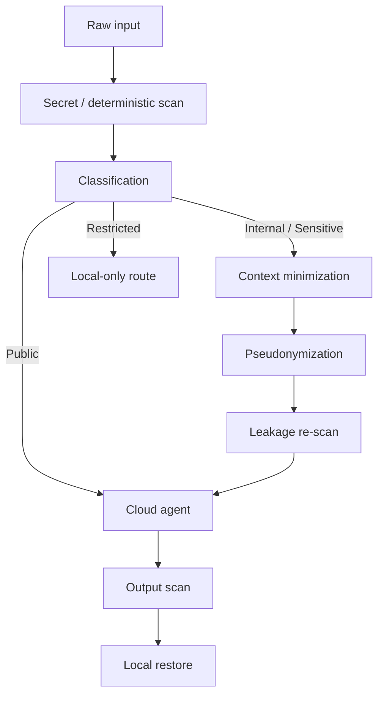

# Privacy and Trust

## Status

**Planned architecture. Not a production security boundary.**

This document defines how a future local/privacy lane could fit into the collaboration architecture without turning the project into a security framework.

## Goal

Reduce unnecessary disclosure when a useful cloud agent is stronger or better equipped for a task, while ensuring that some classes of data never leave the local environment.

The model is:

> **classify locally → minimize locally → pseudonymize when appropriate → use cloud selectively → restore locally**

It is not:

> “encrypt arbitrary confidential data and expect the cloud model to reason over ciphertext.”

## Trust classes

| Class | Example | Default route |
|---|---|---|
| **Public** | public docs, public code, generic research | Cloud allowed |
| **Internal** | names, internal identifiers, routine business context | Local minimization/redaction; cloud only if policy allows |
| **Sensitive** | proprietary project names, technical identifiers, design details that can be abstracted | Reversible pseudonymization; cloud only if policy allows |
| **Restricted** | secrets, credentials, private keys, data forbidden by policy/contract, material whose meaning itself is confidential | Local only |

Classification is organization-specific. This table is an architecture example, not a compliance policy.

## Proposed pipeline



The exact pipeline can be simplified by policy. Not every request needs every stage.

## Mature building blocks

The project should not reinvent general PII detection.

[Presidio](https://github.com/data-privacy-stack/presidio) is a mature open-source project for detecting, redacting, masking, and anonymizing sensitive information across multiple data types. It is a suitable reference for deterministic detection/anonymization primitives.

A prior project, [LLM Guard](https://github.com/protectai/llm-guard), demonstrated LLM input/output scanners and anonymize/deanonymize patterns. Its repository is currently archived, so it is better treated as a design precedent than as a long-term dependency.

## Why a local model is still useful

Traditional PII detection focuses on recognizable categories such as names, email addresses, IP addresses, and other structured identifiers.

Organizations also have context-specific sensitive concepts:

- internal project names;
- proprietary equipment or process identifiers;
- unpublished design terminology;
- customer aliases;
- internal code names;
- source symbols that reveal architecture.

A local LLM such as a Qwen-family model can **supplement** deterministic detection by classifying whether a concept is sensitive in local organizational context.

It should not be the sole policy authority.

Recommended responsibility split:

```text
Deterministic rules / secret scanner
    -> hard block / hard allow categories

Local semantic classifier
    -> additional risk signal

Policy
    -> final route decision
```

## Reversible pseudonymization

Sensitive values can be replaced with stable local tokens:

```text
real equipment name -> <EQUIPMENT_A>
project codename     -> <PROJECT_B>
internal parameter   -> <PARAM_C>
```

The mapping is kept in a **local vault**.

```text
<EQUIPMENT_A> -> original value
<PROJECT_B>   -> original value
<PARAM_C>     -> original value
```

For simple workflows, the mapping can remain in ephemeral local memory. If persistence is required, it should stay in a local vault rather than become distributed coordination state. This avoids introducing state synchronization merely to support pseudonym restoration.

The vault itself should use ordinary local security controls such as OS-protected credentials or encryption at rest.

### Important distinction

Pseudonymization is **not encryption**.

The cloud model sees readable semantic structure with substituted identifiers. This is what allows it to reason about the task.

Therefore:

> **Pseudonymization reduces exposure; it does not make cloud processing risk-free.**

## Residual risks

Even after identifiers are removed, remaining context may reveal the subject through:

- unique technical characteristics;
- combinations of facts;
- dates and locations;
- unusual process descriptions;
- code structure;
- domain-specific terminology.

This creates semantic re-identification risk.

For this reason, some tasks should remain **Local only** even if token replacement is technically possible.

## Security boundary

The trust boundary should be enforced locally by policy and tooling.

Do not rely on:

- a prompt telling a cloud agent not to reveal data;
- a local LLM being correct every time;
- pseudonymization alone;
- a claim that a provider will never retain or inspect data;
- a generic “enterprise-safe” label.

## Evaluation direction

Before promoting this layer from **Planned** to **Implemented**, test at least:

- sensitive-entity false negatives;
- secret leakage;
- semantic re-identification cases;
- token/restore accuracy;
- output leakage;
- local-only policy enforcement.

No production-security claim should be made before those tests exist.
