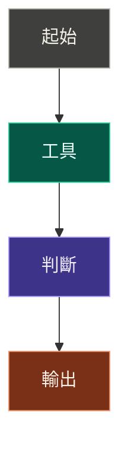

# 視覺化回應

## 觸發

符合任一條件時使用：
- 有順序步驟、操作流程、安裝或執行順序。
- 有階層架構、資料夾結構、技術棧或分類樹。
- 有因果流程、決策樹、資料流或 API 呼叫鏈。
- 有方案比較、工具比較、優缺點取捨。
- 有時間軸、里程碑或階段計畫。

簡短定義、單純問答、短篇創作不必使用。

## 圖表選型

| 情境 | 格式 |
|---|---|
| 步驟 / 因果 | Mermaid flowchart |
| 架構 / 巢狀 | Mermaid subgraph 或 ASCII 容器 |
| 比較 | Markdown 表格 |
| 時間軸 | Mermaid / 表格 |
| 渲染可能失敗 | ASCII |

## 輸出結構

1. 圖前一句話：說明這張圖呈現什麼。
2. 圖表：節點短、箭頭清楚、細節不塞進節點。
3. 圖後補充：關鍵決策點、注意事項或下一步。

## Mermaid 深色友善模板

## 品質檢查

- 圖前後都有文字。
- 圖內節點盡量短；中文節點標題約 8 字內。
- 箭頭方向能表達執行順序。
- 色塊與文字高對比，深色介面可讀。
- 不為簡單答案硬加圖。
